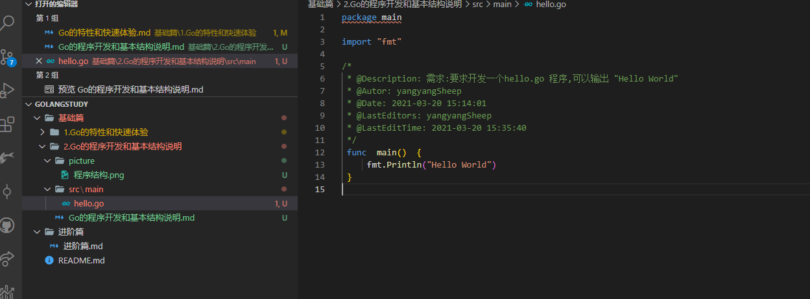

# Go的程序开发和基本结构说明

> 程序结构
> 
> 
> 对于上图的说明

- Golang文件的后缀是go  
- package  
    表示该hello.go的文件所在的包是main,在go中,每个文件都必须归属于一个包
- import "fmt"
    表示引入一个包,包名为fmt,引入该包后,就可以使用fmt包的函数,比如 `fmt.Println()`
- func main(){}
    func 是一个关键字,表示一个函数
    main 是函数名,是一个主函数,即我们程序的入口
- fmt.Println("")
    表示调用fmt包的函数Println输出`Hello World`

> 通过 `go build`命令对该go文件进行编译,生成 .exe文件  
> 编译后会得到一个.exe文件 在运行该文件即可
> 
> 注意:通过 `go run` 命令可以直接运行 `hello.go`直接执行源代码,类似于执行一个脚本文件的形式

# Golang的执行流程分析

> 如果是对源码编译后再执行,Golang的执行流程如下  
>   
> 如果是对源码直接执行`go run`,Golang的执行流程如下  
>   
> 前者执行速度快,后者执行速度慢

## 两种执行流程的方式区别

1. 如果我们先编译生成了可执行文件,那么我们可以将该可执行文件拷贝到没有Golang开发环境的机器上,仍然可以运行

2. 如果我们是直接`go run` go的源代码,那么如果要在另一个机器上也这么运行,也需要go开发环境,否则无法执行

3. 在编译时,编译器会将程序运行依赖的库文件包含在可执行文件中,所以,可执行文件会变大很多

# 编译和运行的说明

## 什么是编译

1. 有了go源文件,通过编译器将其编译成机器可以识别的二进制码文件

2. 在该源文件目录下,通过`go build`命令对该go文件进行编译.可以指定生成的可执行文件名`go build -o xxx.exe xxx.go`,在Windows下必须是.exe后缀

3. 如果程序没有错误,没有任何提示,则会在当前目录下生成一个可执行文件(Windows下是.exe Linux下是一个可执行文件),该文件是二进制码文件,也是可执行的程序

4. 如果程序有错误,编译时,会在错误的那行报错

## 什么是运行

1. 直接运行生成的可执行Go程序,比如hello.exe

2. 通过运行工具`go run`对文件进行执行

# Go程序开发的注意事项

1. Go的源文件以".go"为扩展名

2. Go应用程序的执行入口是`main()`方法

3. Go语言严格区分大小写

4. Go方法由一条条语句构成,每个语句后面不需要分号(Go语言会在每行后面自动加分号),这也体现出Golang的简洁性

5. Go编译器是一行行进行编译的,因此我们一行就写一条语句,不能把多条语句写在同一行,否则报错(遵循上述规则,如果语句后面加上分号再写下一条语句，都写在一行是可以进行编译的)

6. Go语言定义的变量或者import的包如果没有使用到,代码不能编译通过

7. 大括号都是成对出现的,缺一不可

# Golang的常用转义字符(escape char)

| 字符 | 作用                      |
| ---- | ------------------------- |
| \t   | 一个制表符,实现对齐的功能 |
| \n   | 换行符                    |
| \\   | 一个\                     |
| \"   | 一个"                     |
| \r   | 一个换行符                |

# Golang的注释(comment)

用于注解说明解释程序的文字

## Golang中的注释类型

Golang支持C语言风格的/**/块注释,也支持C++风格的//行注释 行注释更通用,块注释主要针对与包的详细说明或者屏蔽大块的代码

1. 行注释

2. 块注释(多行注释)

### 正确的注释风格

1. Go官方推荐使用行注释来注释整个方法的语句

正确的缩进和空白

1. 使用一次tab操作,实现缩进,默认整体向右移动,使用shift+tab整体想坐移

2. 或者使用 `gofmt` 来进行格式化

3. 运算符两边习惯性各加一个空格: 2 + 4 * 5
