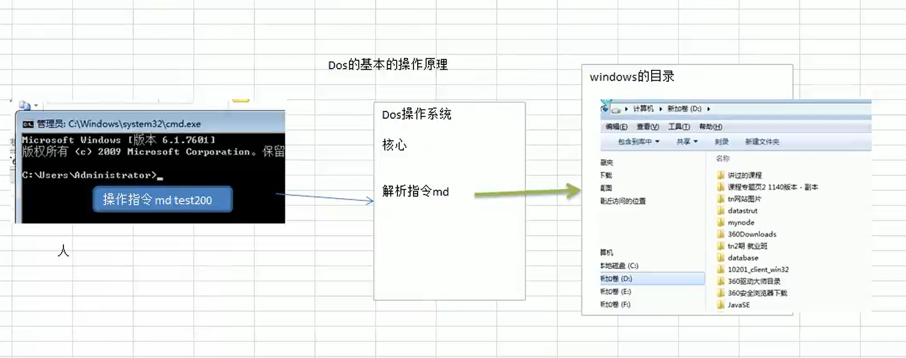

# DOS

## DOS基本介绍

DOS: Disk Operating System 磁盘操作系统

### DOS基本操作原理

`cmd` 进入的是操作DOS的一个终端而已,并非是真正的DOS系统  
>   

#### 目录操作指令

1. 查看当前目录包含的目录以及文件  `dir`

2. 切换到其他盘符下 `cd /d H:`

3. 切换目录 `cd H:\xxxx`(在H盘的时候可以使用)  `cd /d H:\Material`  
   绝对路径:从当前盘的最上面开始定位寻找(如C: D: F:),找到对应的目录  
   相对路径:从当前位置开始定位寻找,找到对应的目录  

4. 切换到上级目录 `cd ..`

5. 切换到根目录 `cd \``

6. 新建目录 `md`(make directory)  
   新建一个目录 `md xxx`  
   新建多个目录 `md xxx1 xxx2`  

7. 删除目录 `rd`(remove directory)  
   删除空目录 `rd xxx1`  
   删除非空目录以及下面的子目录和文件,不带询问 `rd /q/s xxx1` (/q 不询问 /s 层级式的删除)  
   删除非空目录以及下面的子目录和文件,带询问 `rd /s xxx1`

#### 文件操作

1. 新建或追加内容到文件(会覆盖之前的文件内容) `echo hello > H:\Material\abc.txt`  
   追加内容到文件 `echo aaaaaaaaaasdad >> H:\Material\abc.txt`  

2. 复制文件到指定位置 `copy H:\Material\abc.txt H:\`  
   复制文件到指定位置并且重新命名 `copy H:\Material\abc.txt H:\ok.txt`  

3. 移动文件到指定的位置 `move H:\Material\abc.txt H:\`  
   移动文件到指定位置并且重新命名 `move H:\Material\abc.txt H:\ok3.txt`  

4. 删除指定的文件 `del H:\ok3.txt`  
   删除盘符H:层级下(不包含子目录)所有xyz后缀的文件 `del H:\*.xyz'  

#### 其他指令和综合练习

1. 清屏 `cls`  

2. 退出DOS `exit`  
