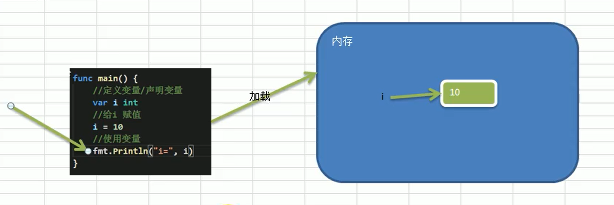

# Golang变量

## 为什么需要变量

一个程序就是一个世界  
**变量是程序的基本组成单位**  不论是是用那种高级程序语言编写程序,变量都是其程序的基本组成单位  

## 概念

> 变量相当于内存中一个数据存储空间的表示,你可以吧变量看作是一个房间的门牌号,通过门牌号我们可以找到房间,同样的道理,通过变量名可以访问到变量(值)

## 变量使用的基本步骤

1. 声明变量(定义变量)

2. 非变量赋值

3. 使用变量

> [变量使用的基本步骤](../../基础篇/4.Golang变量/src/main/main.go)  

## 变量的使用注意事项和细节

1. 变量表示内存中的一个存储区域

2. 该区域有自己的名称(变量名)和类型(数据类型)

3. Golang变量使用的三种方式
   - 指定变量类型,声明后若不赋值,使用默认值
   - 根据值自行判断变了类型(类型推导)
   - 省略`var`,注意`:=`左侧的变量不应该是已经声明过的,否则会导致变异错误

4. 多变量声明  
   在编程中,有时我们需要一次性声明多个变量,Golang也提供这样的语法

### 变量在代码运行中的变化  

>   
> 前提:所有的代码要运行起来必须先**加载到内存中去**  
> 当运行到变量那一行的时候,在内存中会开辟出一个内存空间(数据空间),同时一个叫i的变量也生成了  
> 变量i会直接跟数据空间关联起来,当声明变量没有赋值的时候,其实i有一个默认值为0  
> 当赋值之后,计算机会通过i变量名,找到这个空间,并且把这个0改成10,最后输出  
