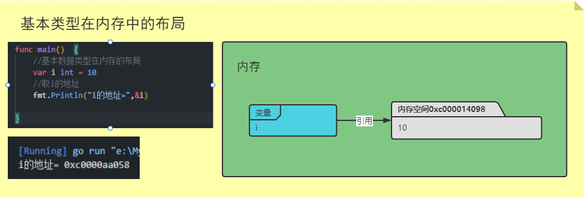
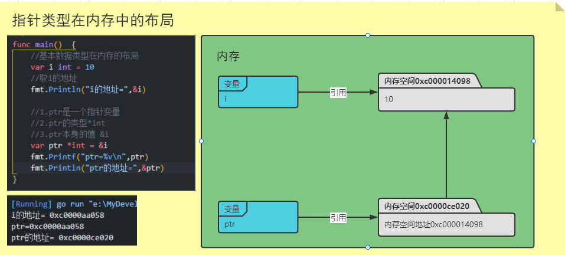

# 指针

## 基本介绍

> 案例演示 [指针类型演示](./src/main/main.go)  

1. 基本数据类型，变量存的就是值，也叫值类型
  
2. 获取变量的地址，用`&`，比如：`var num int`，获取num的地址：`&num`  
3. 指针类型，变量存的是一个地址，这个地址指向的空间存的才是值，比如：`var ptr *int = &num`  
4. 获取指针类型所指向的值，使用：`*`，比如：`var ptr *int = &num`，使用`*ptr`获取p指向的值  
    > `var ptr *int = &num`中prt就是一个指针名，指向一个int  
    > 如果写成`var ptr int = &num`，ptr就是一个整数变量  
  
