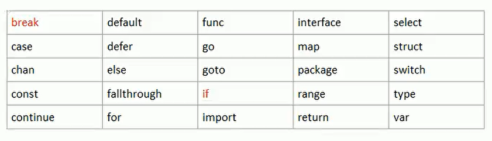

# 值类型

> 基本数据类型`int`系列，`float`系列，`bool`，`string`，数组和结构体 `struct`  

## 值类型使用特点

> 变量直接存储值，内存通常在栈中分配
>   

# 引用类型

> 指针、slice切片、map、管道chan、interface等  

## 引用类型使用特点

> 变量存储的是一个地址，这个地址对应的空间才是真正存储数据（值）的，内存通常在堆上分配，**当没有任何变量引用这个地址时，该地址对应的数据空间就会成为一个垃圾，由GC来回收**
>   

# 标识符

## 标识符的命名规范（重点）

1. Golang对各种变量、方法等命名时使用的字符序列（字符串）成为标识符  
2. 凡是自己可以起名字的地方都叫标识符：var **num** int | var **name** string  

## 标识符的命名规则

1. 标识符只能包含：26个英文字母的大小写、0-9、_(下划线)  
2. 数字不能作为开头  
3. Golang严格区分大小写  
4. 标识符不能包含空格  
5. 下划线“_”本身在Golang中是一个特殊的标识符，称为**空标识符**。可以代表任何其他的标识符，但是它对应的值会被忽略（比如忽略某个返回值）。所以仅能作为占位符使用，不能作为标识符使用  
6. 不能以系统保留关键字作为标识符，比如`break`，`if`等  

## 注意事项

> int 可以作为标识符，但是绝对不建议使用，int不是保留关键字是预定义的标识符  
> 单独使用“_”语法编译不会通过  

1. 包名，保持package的名字和目录保持一致，尽量采取有意义的包名，简短且有意义，不要和标准库冲突  
2. 变量名、函数名、常量名，采用驼峰  
3. 如果变量名、函数名、常量名首字母大写，则可以被其他的包访问，如果首字母小写，则只能在本包中使用（可以简单的理解成，**首字母大写的是公有的【java是通过public关键字】，首字母小写的是私有的【private】**），在Golang中是没有`public`、`private`等关键字的  

# 内存空间分区

  

> 除此之外还有代码区等分区  
> Golang有一个特点：编译逃逸分析，由此决定到底放在哪里，有可能值类型在堆区，也有可能引用类型在栈区  

# 保留关键字

> 在Golang中，为了简化代码编译过程中对代码的解析，其定义的保留关键字**只有25个**，如下：
>   

# 预定义标识符
