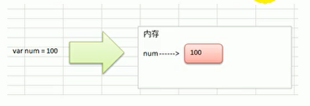
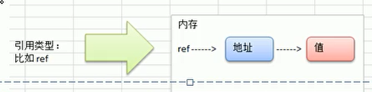
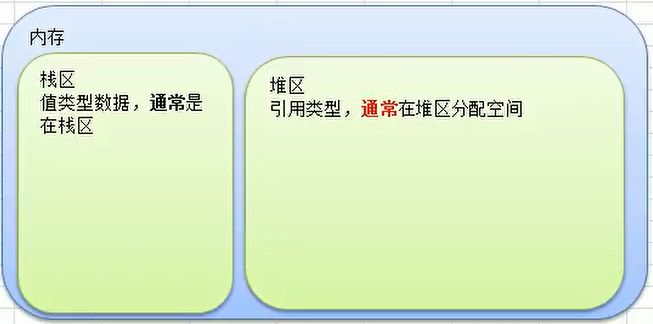

# 值类型

> 基本数据类型`int`系列，`float`系列，`bool`，`string`，数组和结构体 `struct`  

## 值类型使用特点

> 变量直接存储值，内存通常在栈中分配
>   

# 引用类型

> 指针、slice切片、map、管道chan、interface等  

## 引用类型使用特点

> 变量存储的是一个地址，这个地址对应的空间才是真正存储数据（值）的，内存通常在堆上分配，**当没有任何变量引用这个地址时，该地址对应的数据空间就会成为一个垃圾，由GC来回收**
>   

# 内存空间分区

  

> 除此之外还有代码区等分区  
> Golang有一个特点：编译逃逸分析，由此决定到底放在哪里，有可能值类型在堆区，也有可能引用类型在栈区  
